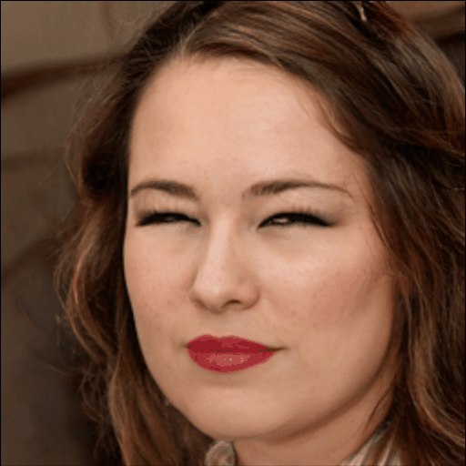
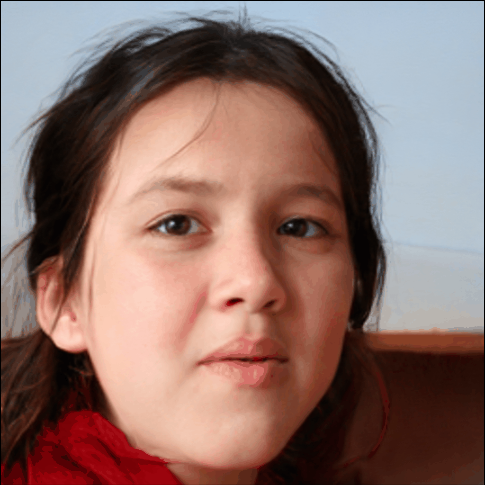
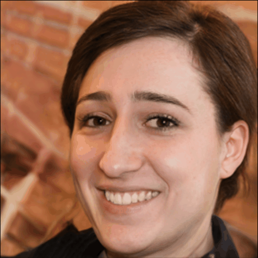
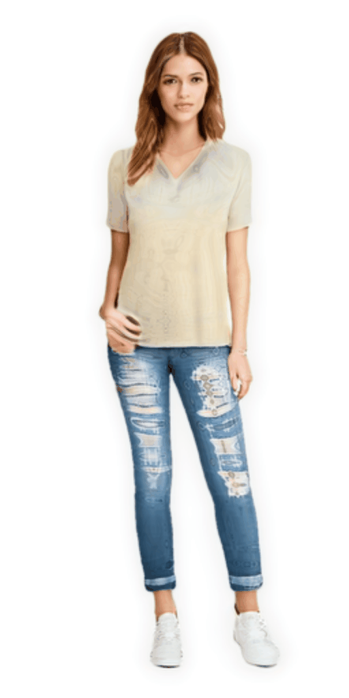
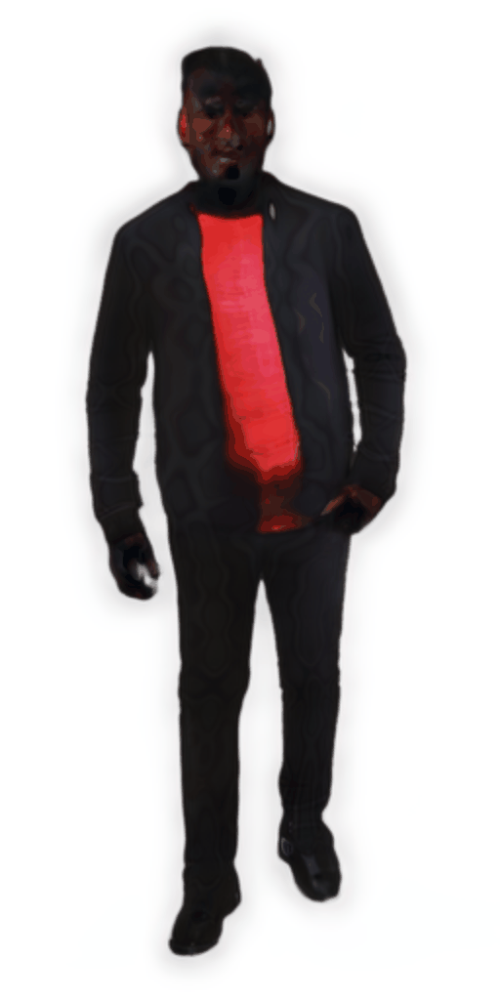
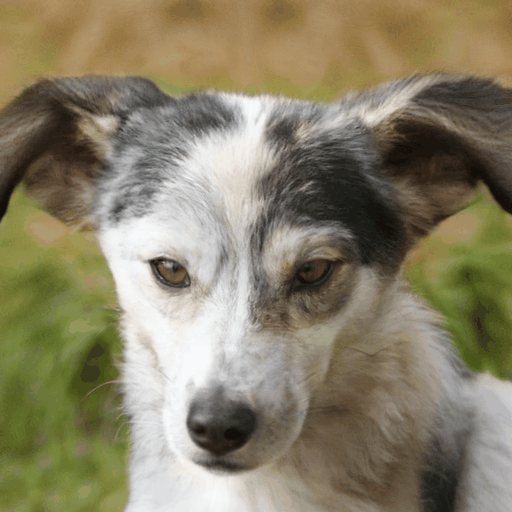
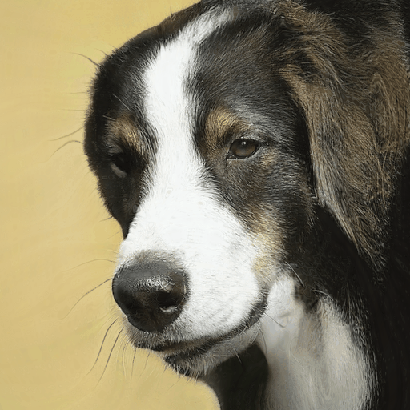
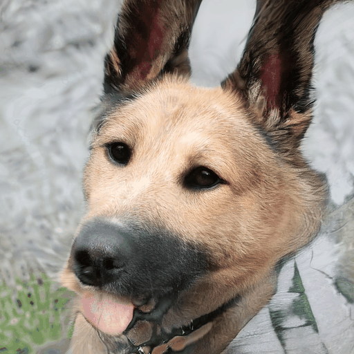
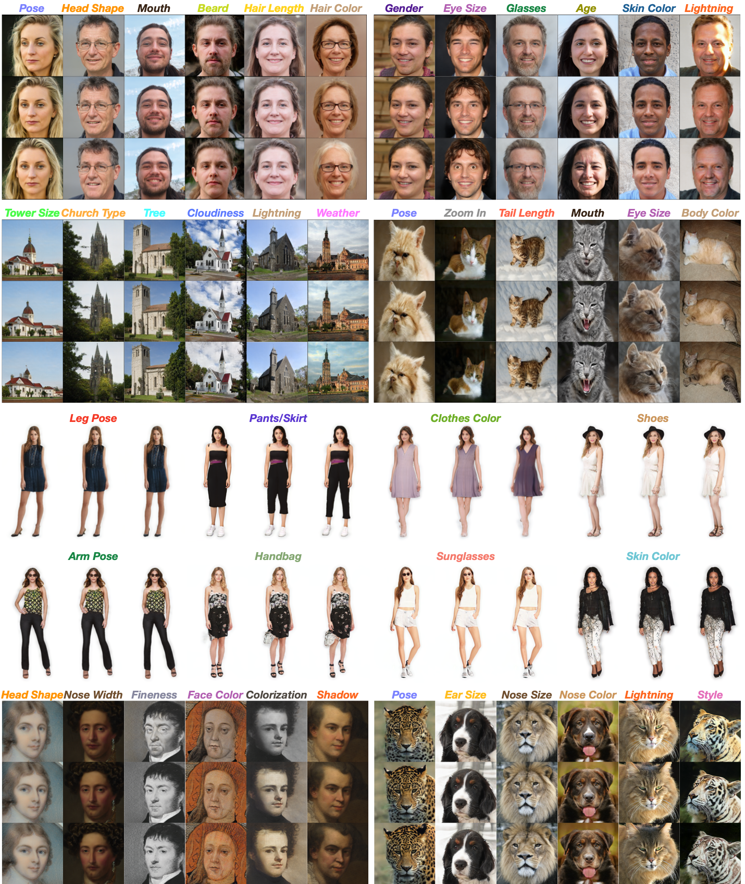

# HouseholderGAN

ICCV23 paper [Householder Projector for Unsupervised Latent Semantics Discovery](https://arxiv.org/pdf/2307.08012.pdf)

<!--Eye Size          |                  Head                   |  Expression
:-------------------------:|:---------------------------------------:|:-------------------------:
 |  |   

   Clothes        |                  Shape                   |  Color
:-------------------------:|:----------------------------------------:|:-------------------------:
 |  |  


   Shape        |                    Pose                     |  Color
:-------------------------:|:-------------------------------------------:|:-------------------------:
 |  |  -->

<p align="center">

  <br>
Some identified attributes in StyleGAN2/StyleGAN3.
</p>

This paper proposes Householder Projector, a flexible and general low-rank orthogonal matrix representation based on Householder transformations, to parameterize the projection matrix of StyleGANs. The orthogonality guarantees that the eigenvectors correspond to disentangled interpretable semantics, while the low-rank property encourages that each identified direction has meaningful variations. We integrate our projector into pre-trained StyleGAN2/StyleGAN3 and evaluate the models on several benchmarks. Within marginally 1\% of the original training steps for fine-tuning, our projector helps StyleGANs to discover more disentangled and precise semantic attributes without sacrificing image fidelity.

## Environment

```python
conda env create -f householdergan.yml
conda activate householdergan
```

## Pre-process Datasets
All datasets can be downloaded from the official website. For StyleGAN2 pre-processing, please check and run [prepare_data.py](https://github.com/KingJamesSong/HouseholderGAN/blob/main/StyleGAN2/prepare_data.py). For StyleGAN3 pre-processing, please check and run [datset_tool.py](https://github.com/KingJamesSong/HouseholderGAN/blob/main/StyleGAN3/dataset_tool.py).


## Usage of StyleGAN2 

Training on FFHQ:

```python
python -m torch.distributed.launch train_1024.py \
      --nproc_per_node=4 --master_port=9032 \
      train_1024.py --batch 8 [dataset_path] \
      --ckpt [pretrained_model] --size 1024 --ortho_id -2 --iter 10000000 \
      --checkpoints_dir [save_model_path] \
      --sample_dir [save_sample_path] --loadd --training_FULL --diag_size 10 &
```
Test on FFHQ:

```python
python closed_form_factorization.py --out [factor_path] [save_model_path] --is_ortho &

wait

python apply_factor.py --output_dir [save_results_path] \
  --ckpt [save_model_path] \
   --factor [factor_path] --ortho_id -2 --size 1024 &

wait
```

Evaluation (FID, PPL, PIPL)

```python
python fid.py [save_model_path] \
        --ortho_id -2 \
        --inception inception_ffhq.pkl \
        --size 1024

wait

python closed_form_factorization.py --out [factor_path] \
    [save_model_path] --is_ortho --diag_size 10 \

wait

python ppl_sefa.py [save_model_path] \
    --factor [factor_path] --ortho_id -2
    --sampling full --eps 1.0 --size 1024 \

wait

python ppl.py [save_model_path] --ortho_id -2 --sampling full --size 1024 &

```

## Usage of StyleGAN3 

For hyper-parameters of each dataset like gamma, please refer to [the original StyleGAN3 training configuration](https://github.com/NVlabs/stylegan3/blob/main/docs/configs.md) for details. Here we only show the training script on AFHQv2:

```python
python train.py --outdir=[save_sample_path] --cfg=stylegan3-r \
          --data=[dataset_path] \
      	--cfg=stylegan3-r --gpus=3 --batch-gpu=2 --batch=6 --gamma=16.4 --mbstd-group 2 \
      	--resume=[pretrained_model] \
        --diag_size 10  --is_ortho True --snap 5
```

Test on AFHQv2:

```python
python closed_form_factorization.py --out [factor_path] \
        --resume_pkl [save_model_path] \
        --is_ortho &

wait

python apply_factor.py --outdir=[save_results_path] --cfg=stylegan3-r  \
      --data=[dataset_path] \
     --gpus=1 --batch-gpu=1 --batch=1 --gamma=16.4 --mbstd-group 2 \
    --resume=[save_model_path] \
    --diag_size 10  --is_ortho True --factor [factor_path]

wait
```

## Usage of StyleGANHuman
```
cd StyleGANHuman/training_scripts/sg3/
```
Training on SHHQv1:

```python
python train.py --outdir=[save_results_path] --cfg=stylegan3-r --gpus=4 --batch=16 --gamma=12.4 --mbstd-group 4 \
    --mirror=1 --aug=noaug --data=[dataset_path]  --square=False --snap=5 \
    --resume=[pretrained_model] --diag_size 10  --is_ortho True
```

Test on SHHQv1:

```python
python closed_form_factorization.py --out [factor_path] \
        --resume_pkl [save_model_path] \
        --is_ortho &
wait

python apply_factor.py --outdir=[save_results_path] --cfg=stylegan3-r  \
      --data=[dataset_path]  \
     --gpus=1 --batch-gpu=1 --batch=1 --gamma=16.4 --mbstd-group 1 \
    --resume=[save_model_path]  \
    --diag_size 10  --is_ortho True --factor [factor_path]

wait
```

## Fine-tuned and Pre-trained Models

We release the pre-trained StyleGANs and our fine-tuned models on different resolutions.


| Datset       | Backbone | Resolution | Fine-tuned Model | Pre-trained Model |
|--------------|:--------:|:--------------:|:----------:| :----------:|
| FFHQ         | StyleGAN2 |  256x256   | [:link:](https://drive.google.com/file/d/1mbmGRkrdZfWwCaRRV9OF_xW2AH1Cj0-H/view?usp=sharing) | [:link:](https://drive.google.com/file/d/1mbmGRkrdZfWwCaRRV9OF_xW2AH1Cj0-H/view?usp=sharing) |
| FFHQ         | StyleGAN2 |  1024x1024 | [:link:](https://drive.google.com/file/d/1MEBk5Br2stbaSNl-4ImQQ1qUJnBBQPjM/view?usp=sharing) | [:link:](https://drive.google.com/file/d/1EqgBZKvqiC32yjGl-dSG8lqXcU927JmI/view?usp=sharing) |
| LSUN Church  | StyleGAN2 |  256x256   | [:link:](https://drive.google.com/file/d/15Nzei6bMev3gJu3votONi9LqcqU1ihiN/view?usp=sharing) | [:link:](https://drive.google.com/file/d/1Be3fKnwHYnbHUBMTpWfjKzF5YD828IjB/view?usp=sharing) |
| LSUN Cat     | StyleGAN2 |  256x256   | [:link:](https://drive.google.com/file/d/1bon039aXMfsY72ApRv_lJ3160HDsa353/view?usp=sharing) | [:link:](https://drive.google.com/file/d/1icL6XqN7-oLpcYBzODQnF2Pd2KtkT-R1/view?usp=sharing) |
| AFHQv2       | StyleGAN3 |  512x512   | [:link:](https://drive.google.com/file/d/1OZsu5RPeBbxk4mNfqEoq0e_Af5GZFpf9/view?usp=sharing) | [:link:](https://drive.google.com/file/d/1HJUlp-Yfe7bGLV5XktIVLBZxmY1Q2ep8/view?usp=sharing) |
| MetFaces     | StyleGAN3 |  1024x1024 | [:link:](https://drive.google.com/file/d/14_Qt4n5N1n45c0-BATXjZ-BpMEzWhbL1/view?usp=sharing) | [:link:](https://drive.google.com/file/d/1vPo-eojSbXt9FHsMCEv1jLc1pQhqmcdy/view?usp=sharing) |
| SHHQv1         | StyleGAN3 |  512x256   | [:link:](https://drive.google.com/file/d/1y40QPk_OAS-1pNcpajt-e_wuWlAJcMQo/view?usp=sharing) | [:link:](https://drive.google.com/file/d/1tyi4hVjfJiGVrcukVRbdJaMkmR8yIvbK/view?usp=sharing) |

## Citation 
If you think the codes are helpful to your research, please consider citing our paper:

```
@inproceedings{song2023householder,
  title={Householder Projector for Unsupervised Latent Semantics Discovery},
  author={Song, Yue and Zhang, Jichao and Sebe, Nicu and Wang, Wei},
  booktitle={ICCV},
  year={2023}
}
```

## Contact

If you have any questions or suggestions, please feel free to contact us

`yue.song@unitn.it` or `jichao.zhang@unitn.it`
